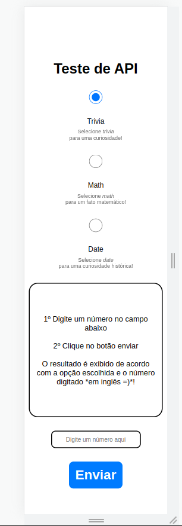

<h1>API de números</h1>  
    

    Este projeto foi o meu primerio contato com uma API, e a API utilizada aqui foi retirada do site <a href="http://numbersapi.com/#42">Numbers API</a>.    
    <h2>O que esta API faz?</h2>
    
Pirmeiramente, ela necessita de um número em sua URL, e depois, ela pode receber um dos 4 parâmetros a seguir: 
        <ul>
            <li>Trivia (curiosidades)</li>
            <li>Math (matemática)</li>
            <li>Date (data)</li>
            <li>Year (ano)</li>
        </ul>
        Nesta explicação, não entraremos em detalhes sobre cada parâmetro e o que ele retorna, pois não é o foco aqui. Mas uma informação importante é saber que caso nenhum valor seja escolhido, o valor padrão que será acessado pela API é o <i>Triva</i>. Após preencher a URL com o número e uma das 4 opções a cima, ela então retornará, por exemplo, uma curiosidade sobre aquele número na tela do usuário.
     

    

    <h3>Um pouco do funcionamento</h3>   
        
    <h3>Design mobile</h3>   
        

